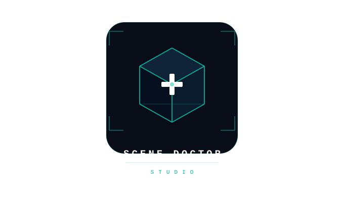

# 🩺 Scene Doctor Studio

<p align="center">
  
</p>

<p align="center">
  <strong>AI-powered 3D scene diagnostics for Maya and Blender</strong><br>
  Scan, analyze, and fix your scenes without leaving your DCC.
</p>

<p align="center">
  
  
  
  
  
</p>

---

## What is Scene Doctor Studio?

A standalone desktop app that connects to Maya/Blender via TCP sockets and uses AI to:
- **Scan** your scene for geometry, animation, and setup issues
- **Explain** problems in plain language (not programmer jargon)
- **Fix** issues by generating and executing Python code directly in your DCC
- **Document** your scene with auto-generated technical reports

Think of it as having an experienced TD sitting next to you, ready to help.

---

## ✨ Features

### 🔌 DCC Connection
| DCC | Port | Method |
|-----|------|--------|
| Maya | 7001 | `cmds.commandPort` |
| Blender | 7002 | Built-in addon socket server |

- Real-time connection indicator (🟢 connected / 🔴 disconnected)
- Auto-detects connected DCCs on session creation
- Smart blocking: scene questions are blocked when DCC is disconnected, but general knowledge questions still work

### 🔍 Scene Scanning

**Full Scene Scan** — One-click health report:
- Object count, types, hierarchy depth
- Mesh stats (verts, faces, edges per object)
- Lights, cameras, materials overview
- Animation overview (keyframe count, tangent breakdown, timeline info)
- Issues flagged with severity: 🔴 Critical / 🟡 Warning / 🟢 Info

**Selection Scan** — Deep analysis of selected objects:
- Non-manifold geometry (vertices & edges)
- Lamina faces, border/hole edges
- Zero-length edges, zero-area faces
- N-gons and triangles count
- Overlapping vertices
- Non-frozen transforms
- Construction history / unapplied modifiers
- Missing UVs, missing materials
- Animation: keyframes, tangent types (stepped/spline/linear), broken tangents, keys outside range, sub-frame keys, constraints

### 📷 Viewport Capture
- **Maya**: Playblast-based capture
- **Blender**: Workbench engine render
- Sends viewport image to vision-capable AI models
- Auto-detects if model supports vision (GPT-4o, Gemini, LLaVA, Llama-4-Scout)

### 🤖 AI Agents

**Single Agent Mode** — One AI handles analysis + code writing. Best for fast models.

**Multi Agent Mode** — Specialized pipeline:
| Agent | Role |
|-------|------|
| 🔍 Analyzer | Understands scenes, explains issues, asks before fixing |
| 🔧 Code Writer | Writes Maya/Blender Python code based on analysis |
| 👁 Vision | Reads viewport screenshots |
| 💬 Summary | Summarizes long conversations |

The Analyzer's output flows automatically to the Code Writer when the user requests a fix — no manual handoff needed.

### 🧠 AI Modes (via Mode Selector)

| Mode | Behavior |
|------|----------|
| **Normal** | Standard responses |
| **🧠 Adaptive Thinking** | AI reasons step-by-step before answering (best with GPT-4o, Claude) |

### ⚡ Input Panel Toggles (via + Menu)

| Toggle | Behavior |
|--------|----------|
| **🔍 Search Mode** | Searches the web (DuckDuckGo) for solutions, tutorials, fixes |
| **📋 Step-by-step** | AI explains answers in numbered steps (persistent) |
| **📐 Plan Mode** | AI plans before answering (persistent) |
| **⚡ Auto-run Code** | Automatically executes generated code in DCC |
| **📷 Viewport Image** | Attach viewport screenshot to next message |

### 💬 Chat Features
- Streaming responses (token by token, no waiting)
- Code blocks with **▶ Run** and **✕ Dismiss** buttons
- Code executes directly in your DCC (Maya/Blender)
- `<think>` tag stripping (hides AI internal reasoning)
- Auto-expanding input field (grows with text, 36px → 120px)
- Token counter (color-coded: gray/orange/red)
- Keyboard shortcuts: `Ctrl+K` (new session), `Ctrl+B` (toggle sidebar)
- Drag & drop images into chat

### 📄 Artifacts System (Claude-style)

**Smart Detection** — Auto-creates artifacts when:
- Code blocks > 10 lines
- SVG or Mermaid diagrams
- User says "save", "artifact", "export"
- Creation commands with substantial output
- Long structured responses (headers, lists, tables)

**Artifact Panel** (right side, resizable):
- List view with file type icons
- Code viewer with syntax display
- **▶ Run** button for .py artifacts
- **📋 Copy** button
- **⬇ Download** individual or all artifacts
- Smooth open/close animation

**Naming**: Meaningful filenames derived from user message (not random IDs)

### 📝 Documentation Mode
- Click **📄 Doc** button → generates a structured technical report
- Scans selected objects for detailed attributes, connections, parameters
- Always saves as `.md` artifact
- Sections: Overview, Object Breakdown, I/O, Parameters, Issues, Recommendations

### 🌐 Web Search
- Toggle Search Mode from + menu
- Searches DuckDuckGo for solutions (tutorials, fixes, tips)
- Auto-appends DCC name for better results
- AI summarizes the best solution — doesn't dump raw links
- No API key needed

### 🗂️ Session Management
- Sessions organized by DCC: `sessions/maya/`, `sessions/blender/`
- Auto-detects scene name from DCC
- Auto-save chat history + artifacts
- Rename, delete sessions (right-click menu)
- DCC filter tabs (All / Maya / Blender)
- Search sessions by name
- Collapsible sidebar (56px rail with icons)

### ⚙️ Settings
- **AI Mode**: Single / Multi agent
- **Backend**: Local (Ollama) or External API (OpenAI, Groq, Together, etc.)
- **Per-agent config**: Base URL, API Key, Model name
- **Copy to all agents**: One-click config duplication
- **Appearance**: Dark/Light theme
- **Accent color**: 8 presets + custom color picker
- **About You**: Personal profile (role, tools, preferences) — AI uses this for context

### 🎨 Themes
- **Dark** — Deep navy with teal accents
- **Light** — Clean warm gray
- Accent color customization
- All UI elements update instantly on theme change

### 🛡️ Safety
- Connection check before any scene interaction
- Smart detection: blocks scene questions when disconnected
- General knowledge questions always work
- Code execution guard (prevents double-run)
- Auto-run mode requires confirmation dialog
- 90-second safety timeout resets busy state

---

## 🚀 Quick Start

### Prerequisites
- Python 3.10+ (tested with 3.14)
- PySide6
- Maya 2022+ or Blender 3.2+
- AI backend: [Ollama](https://ollama.ai) (local) or any OpenAI-compatible API

### Installation

```bash
# Clone the repo
git clone https://github.com/yourusername/scene-doctor-studio.git
cd scene-doctor-studio

# Install dependencies
pip install PySide6

# Run
python main.py
```

### Maya Setup
Open Maya Script Editor and run:
```python
import maya.cmds as cmds
cmds.commandPort(name=":7001", sourceType="python", echoOutput=True)
```

### Blender Setup
1. Open Blender → Edit → Preferences → Add-ons
2. Install `blender_addon.py`
3. Enable "Scene Doctor Connector"
4. The socket server starts automatically on port 7002

### First Use
1. Launch `python main.py`
2. Open Maya or Blender with the connector enabled
3. Click **+ New Session** — it auto-detects your DCC
4. Start chatting, or click **Scan Scene** / **Scan Selection**

---

## 🤖 Supported AI Models

| Provider | Models | Vision | Notes |
|----------|--------|--------|-------|
| **Groq** | llama-3.3-70b, llama-4-scout | ✓ (scout) | Fast, free tier |
| **OpenAI** | gpt-4o, gpt-4o-mini | ✓ | Best quality |
| **Google** | gemini-2.0-flash | ✓ | Fast + vision |
| **Anthropic** | claude-3-5-sonnet, claude-3-opus | ✓ | Best for coding & reasoning |
| **Ollama** | llama3, mistral, codellama, llava | ✓ (llava) | Local, private |
| **DeepSeek** | deepseek-v3, deepseek-r1 | ✗ | Great for code |
| **Any OpenAI-compatible** | — | Depends | Custom endpoints |

**Recommended setup:**
- Single agent: `gpt-4o` or `llama-3.3-70b`
- Multi agent: Analyzer = `gpt-4o`, Code Writer = `deepseek-coder`, Vision = `gemini-2.0-flash`

---

## 📁 Project Structure

```
scene_doctor_studio_v1/
├── main.py                    # Main application window (UI + logic)
├── ui_widgets.py              # Reusable UI components (bubbles, code blocks, themes)
├── ai_backend.py              # AI communication (streaming, prompts, settings)
├── dcc_connector.py           # DCC communication (Maya/Blender TCP sockets)
├── session_manager.py         # Session storage and artifact management
├── studio_settings_dialog.py  # Settings dialog UI
├── settings.py                # Settings defaults and loading
├── blender_addon.py           # Blender socket server addon
├── APP_FUNCTIONS.md           # Complete function reference
├── assets/                    # Logo and icons
└── icons for buttoms/         # Button SVG icons
```

### Data Storage
```
~/Documents/SceneDoctor/
├── settings.json
└── sessions/
    ├── maya/<session_id>/
    │   ├── chat.json
    │   └── artifacts/
    └── blender/<session_id>/
        ├── chat.json
        └── artifacts/
```

---

## 📋 Keyboard Shortcuts

| Shortcut | Action |
|----------|--------|
| `Enter` | Send message |
| `Shift+Enter` | New line in input |
| `Ctrl+K` | New session |
| `Ctrl+B` | Toggle sidebar |

---

## 🗺️ Roadmap

- [ ] Houdini support (port 7003)
- [ ] Nuke support (port 7004)
- [ ] Plugin marketplace
- [ ] Batch scene processing
- [ ] Custom scan presets
- [ ] Export chat as PDF

---

## 📄 License

MIT License — see [LICENSE](LICENSE)

---

## 👤 Author

**Ezz El-Din Tarek Mostafa**  
CG Technical Director  
[LinkedIn](https://www.linkedin.com/in/ezzel-din-tarek-mostafa)

---

<p align="center">
  Built with ❤️ for 3D artists who want AI-powered scene diagnostics without leaving their DCC.
</p>
